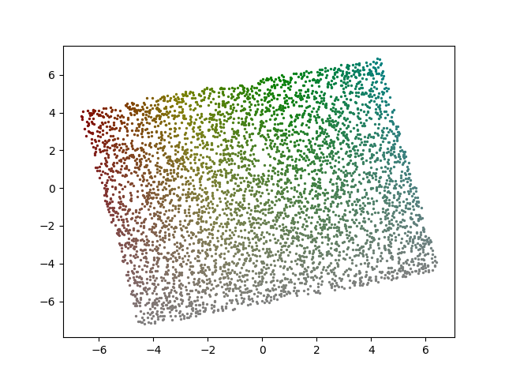

# NewtonianVAE

## Setup

### 1. Install dependencies
```bash
python3 -m pip install -r requirements.txt
```

## How to train [ sample ]

### 1. Collect data
Below command can collect dataset.
```bash
./collect_data.py
```

### 2. Train model
Below command can train the NewtonianVAE model
```bash
./train.py
```

### 3. Check correlation
```bash
./check_correlation.py
```



### 4. Check operability
```bash
./check_operability.py
```


## Dependencies
pixyz>=0.3.3  
torch>=1.12.0  
numpy>=1.23.1  
PyYaml>=5.3.1  
matplotlib>=3.5.2  
tqdm>=4.64.0  
dm_control>=1.0.8  
tensorboardX>=2.5.1  


## Citations
- [Jaques, Miguel, Michael Burke, and Timothy M. Hospedales. "Newtonianvae: Proportional control and goal identification from pixels via physical latent spaces." Proceedings of the IEEE/CVF Conference on Computer Vision and Pattern Recognition. 2021.](https://arxiv.org/abs/2006.01959)  
- [Watters, Nicholas, et al. "Spatial broadcast decoder: A simple architecture for learning disentangled representations in vaes." arXiv preprint arXiv:1901.07017 (2019).](https://arxiv.org/abs/1901.07017)
- [Okumura, Ryo, Nobuki Nishio, and Tadahiro Taniguchi. "Tactile-Sensitive NewtonianVAE for High-Accuracy Industrial Connector-Socket Insertion." arXiv preprint arXiv:2203.05955 (2022).](https://arxiv.org/abs/2203.05955)
